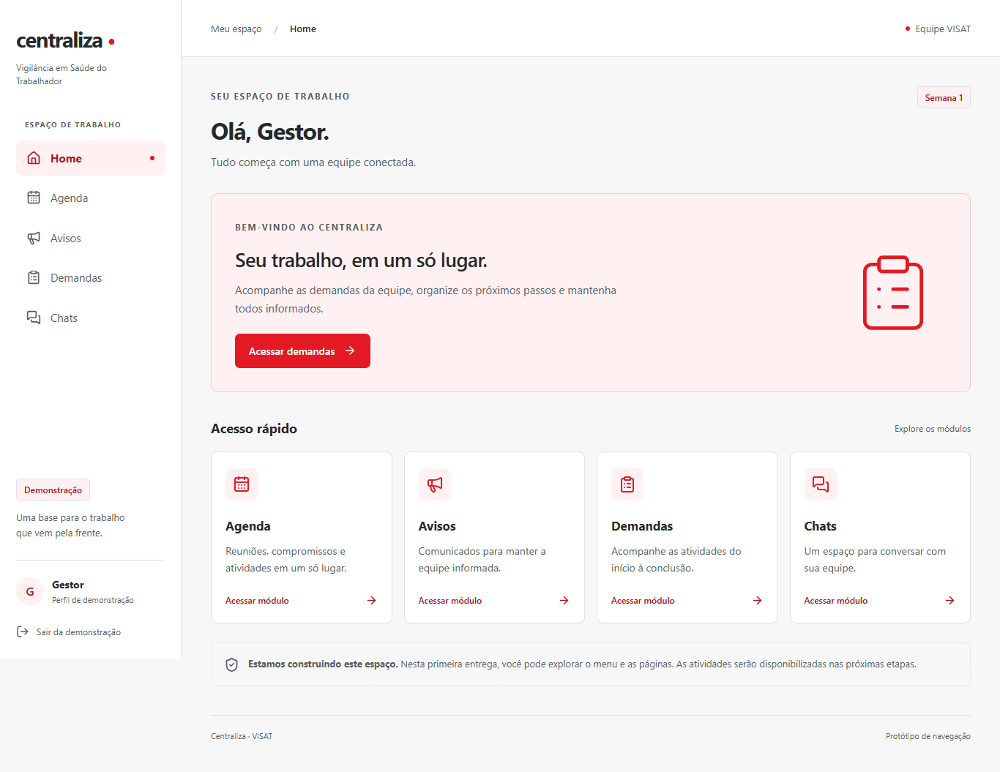
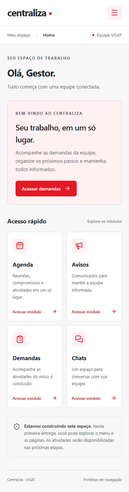

# Centraliza

<p align="center">
  
</p>

A shared workspace for Occupational Health Surveillance (VISAT).
Request management, team coordination, and traceability throughout the inspection workflow.

---

## Overview

Centraliza is a web application project for organizing the daily work of VISAT managers and inspectors. Its goal is to bring requests, deadlines, activity records, meetings, and internal communication into one platform.

VISAT receives requests from institutions such as the Public Labor Prosecutor's Office (MPT), the Regional Labor Court (TRT), health councils, and labor unions. Centraliza is intended to help the team follow these requests from assignment through execution and management review.

The repository currently provides authenticated navigation and an operational request workflow backed by a Django API and PostgreSQL, including management review and protected evidence files.

## Core capabilities

Available in the current version:

- **Responsive workspace** — shared layout and navigation across Home, Agenda, Notices, Requests, and Chats.
- **Authenticated roles** — sign in as a manager or inspector using Django sessions protected by CSRF.
- **Request management** — managers can create, edit, assign, reassign, cancel, and filter team requests by assignee, deadline, or overdue state.
- **Request details and history** — inspect complete request data, add timeline comments, submit work for management evaluation, request corrections, approve, or cancel according to role.
- **Protected evidence files** — attach, list, download, and logically remove PDF, JPEG, and PNG evidence through authorized request endpoints, with every change recorded in the timeline.
- **Team agenda** — browse commitments by day, week, or month; managers can create, edit, link requests, select participants, detect schedule conflicts, and cancel entries in Fortaleza time.
- **Team notices** — managers publish, edit, target, schedule, expire, and cancel urgent or informational notices; inspectors receive the active notices authorized for them.
- **Session navigation** — redirect to the entry screen without a valid server session, preserve the session across reloads, and sign out.
- **Accessible interaction** — keyboard navigation, visible focus, a skip-to-content link, descriptive page titles, and checked color contrast.
- **Recovery states** — loading, empty, API error and retry feedback, plus a page-not-found screen.

Planned operational capabilities:

- **Inspection execution** — expand structured progress records beyond comments and evidence files.
- **Team communication** — exchange messages after the operational core is stable.
- **Monitoring** — summarize pending work, overdue requests, critical activities, and team progress.

## Team workspace

The product is designed around two roles. The API currently restricts managers to their team and inspectors to requests assigned to them; the remaining responsibilities describe the product direction.

| Role | Intended responsibilities |
| --- | --- |
| Manager (Gestor) | Organize the team's requests, set priorities and deadlines, assign inspectors, evaluate completed activities, and coordinate meetings and notices. |
| Inspector (Inspetor) | Follow assigned requests, record progress and evidence, submit activities for review, and consult meetings and team communication. |

The planned workflow is assignment, acceptance, execution, management review, and completion. Requests requiring corrections return to execution before a new review.

## Project documentation

The interface and supporting project documents use Brazilian Portuguese:

- [Project website](https://sites.google.com/cesar.school/g3-projetos2/kick-off) — academic context and project presentation.
- [User stories](https://docs.google.com/document/d/16kUCRMTKoWA6baSPuiB9Tu2W-Y0lDQZfsuvdFY4LZjo/edit?usp=sharing) — proposed user needs.
- [Backlog](https://docs.google.com/document/d/1xlQBoN-2C-LtF59Zb2HhzJUCzOO1bQ3bnZY_P2gJNrY/edit?usp=sharing) — planned features.
- [Development plan](docs/plano-desenvolvimento.md) — tasks, validation process, and Graphify usage.
- [Operational MVP roadmap](docs/plano-mvp-operacional.md) — complete request workflow, protected attachments, managed calendar, notices, and acceptance criteria.
- [Notices and Status Report plan](docs/semana-5.md) — notice MVP, final regression, code freeze, and demonstration checklist.
- [Navigation foundation](docs/semana-1.md) — responsive routes, guards, and accessibility decisions.
- [Request-list implementation plan](docs/semana-2.md) — data rules, delivery tasks, and completion criteria.
- [Request API contract](docs/contrato-demandas.md) — filters, pagination, access rules, and response format.
- [Navigation validation](docs/validacao-semana-1.md) — browser coverage and visual evidence.
- [Request-list validation](docs/validacao-semana-2.md) — integrated flow, tests, and performance measurements.
- [Request-detail validation](docs/validacao-semana-3.md) — status transitions, timeline consistency, and integrated-flow evidence.
- [Attachment validation](docs/validacao-anexos.md) — protected storage, file checks, authorization, and audit trail.
- [Agenda validation](docs/validacao-semana-4.md) — date ranges, timezone, calendar navigation, and role-based results.
- [Managed-agenda validation](docs/validacao-agenda-gerenciavel.md) — management operations, conflicts, logical cancellation, and current limits.
- [Notices validation](docs/validacao-semana-5.md) — feed/detail permissions, regression, accessibility, and integrated evidence.
- [Notice-management validation](docs/validacao-avisos-gerenciaveis.md) — publishing, targeting, validity periods, cancellation, and access rules.
- [Status Report 1 checklist](docs/status-report-1.md) — setup, eight-minute demonstration route, smoke checks, and contingency.
- [Visual palette](docs/paleta-visual.md) — red, graphite, and white identity with accessible supporting tones.

## Screenshots

### Home



### Mobile navigation layout

<p align="center">
  
</p>

These screenshots record the approved visual identity. The published static demonstration may not include the authenticated Django integration available in the repository.

## Technology stack

| Area | Technologies and status |
| --- | --- |
| Web interface | React, TypeScript, Vinext/Vite |
| Styling and icons | CSS, Tailwind CSS, Lucide; shadcn components supplied by the starter |
| Authentication | Django session cookie and CSRF protection through a same-origin development proxy |
| Validation | Playwright, axe-core, TypeScript, Oxlint |
| Architecture mapping | Graphify local AST extraction |
| Demo build | Sites starter with Cloudflare Workers build output; Node for local development |
| Back-end | Python, Django, and Django REST Framework |
| Database | PostgreSQL with migrations and reproducible demonstration data |

## Architecture

```text
centraliza/
├── frontend/
│   ├── app/               Routes, metadata, global styles, and error pages
│   ├── components/        Entry screen, workspace layout, and module content
│   ├── hooks/             Authenticated session lifecycle
│   ├── lib/               API clients and navigation configuration
│   ├── public/            Browser assets
│   └── tests/             Navigation, session, and accessibility checks
├── backend/               Django API, models, migrations, tests, and demo seed
├── assets/                Project identity
├── docs/                  Planning, contracts, validation, and visual references
└── graphify-out/           Versioned code graph
```

Workspace coordinates session state and chooses the appropriate screen. The session hook calls the API adapter in frontend/lib/auth.ts; layout and module components handle presentation. Request filters call frontend/lib/demandas.ts, and calendar ranges use frontend/lib/agenda.ts. The Django API applies role and team authorization before querying PostgreSQL.

The server is a modular Django application backed by PostgreSQL. It currently enforces authentication, request visibility, active statuses, filters, ordering, and pagination.

The current quality baseline includes 60 Django tests and 37 browser scenarios, plus lint, TypeScript, production build, keyboard navigation, responsive checks, and automated accessibility scans. With 1,000 demonstration records, the local sequential request-list benchmark measured a 14.79 ms p95 and a constant four SQL queries per request. See the [request-list validation](docs/validacao-semana-2.md), [managed-agenda validation](docs/validacao-agenda-gerenciavel.md), and [notice-management validation](docs/validacao-avisos-gerenciaveis.md) reports for their methods and limitations.

## Local development

Requirements: Node.js 22.13 or later, npm, Python 3.12 with uv, and PostgreSQL 16 or later. Configure the database variables from `backend/.env.example`.

The prepared Windows workspace uses an isolated PostgreSQL instance on port `55432`. Start it from the repository root:

```powershell
& '.\.local\postgresql\pgsql\bin\pg_ctl.exe' start `
  -D '.\.local\pgdata' `
  -l '.\.local\postgresql.log' `
  -o '-p 55432 -h 127.0.0.1' `
  -w
```

Then prepare and start the API:

```powershell
cd backend
uv sync
uv run python manage.py migrate
$env:CENTRALIZA_DEMO_PASSWORD = "Centraliza@2026"
uv run python manage.py seed_demo --total 30
uv run python manage.py seed_agenda
uv run python manage.py seed_avisos
uv run python manage.py runserver
```

In another terminal, start the interface:

```powershell
cd frontend
npm ci
npm run dev
```

Open the address printed by the terminal, normally http://localhost:3000. The frontend proxies `/api` to http://127.0.0.1:8000. Set `CENTRALIZA_API_URL` before starting the frontend to use another local API address.

### Demonstration accounts

These credentials are only for fictitious local development data. All six accounts currently use `Centraliza@2026`.

| Profile | Usernames |
| --- | --- |
| Manager | `demo.gestor.1`, `demo.gestor.2` |
| Inspector | `demo.inspetor.1`, `demo.inspetor.2`, `demo.inspetor2.1`, `demo.inspetor2.2` |

`seed_demo` sets the password when it creates an account. It preserves the password of an account that already exists, so changing `CENTRALIZA_DEMO_PASSWORD` alone does not reset existing users.

Run the complete validation from the corresponding directories:

```powershell
cd backend
uv run python manage.py test
uv run python manage.py benchmark_demandas --requests 30 --warmup 5

cd ../frontend
npm run lint
npm run typecheck
npm run build
npm test
```

Browser tests use an installed Microsoft Edge. Adjust the channel in frontend/playwright.config.ts for another environment. Generated starter components in components/ui and hooks/use-mobile.ts are excluded from the application lint configuration.

For code exploration, run graphify explain Workspace from the repository root. After source changes, run graphify update . --no-cluster to refresh graphify-out/graph.json. This mode analyzes code locally and does not send it to an external model.

## Data and security

- Demonstration records and accounts are fictitious and do not contain institutional data.
- Django enforces permissions by role, team, assignment, participant, recipient, and validity period; browser guards only control navigation feedback.
- Request transitions and their history are written through transactional backend services.
- Real deployment requires secret rotation, HTTPS, a production application server, persistent protected storage, backup and restore, attachment scanning, monitoring, and agreement on operational access rules with VISAT.

## Product direction

The operational MVP now covers the complete request lifecycle, protected evidence, managed scheduling, and managed notices. The next stage is production hardening and integrated acceptance with VISAT. Account administration, dashboards, notifications, and chat remain later product increments.

## Team

| Member | Role | Contact |
| --- | --- | --- |
| Antônio Marcos Soares de Araujo Filho | Developer | [LinkedIn](https://www.linkedin.com/in/antonio-m-29aa4a3b0/) |
| Arthur Florêncio Afonso de Albuquerque | Solutions Architect | [LinkedIn](https://www.linkedin.com/in/arthur-flor%C3%AAncio-afonso/)<br>[arthurafonsodev@gmail.com](mailto:arthurafonsodev@gmail.com) |
| Cecília de Moraes Andrade Oliveira | UX Designer | [LinkedIn](https://www.linkedin.com/in/ceciliademoraesa) |
| Lívia Cabral da Mata Buonora | Project Manager | [LinkedIn](https://www.linkedin.com/in/l%C3%ADvia-buonora-381294365/) |
| Luiza Beltrão Pereira de Melo | Researcher | [LinkedIn](https://www.linkedin.com/in/luiza-beltr%C3%A3o-pereira-de-melo/) |
| Silvio Ronaldo de Lima Lobo Filho | Product | [LinkedIn](https://www.linkedin.com/in/silvio-lobo-a836b6393/) |
| Victor Bacelar Palazzin | UX Researcher | [LinkedIn](https://www.linkedin.com/in/victor-bacelar-palazzin-a444a23b0/) |
