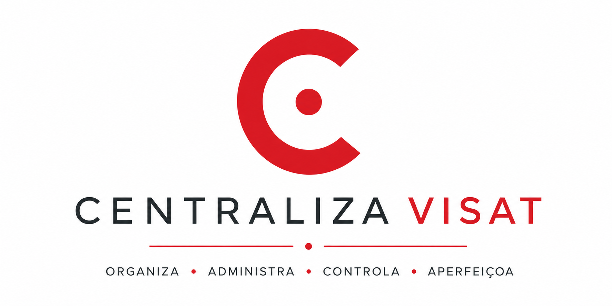

# Centraliza

<p align="center">
  
</p>

<p align="center">
  <strong>Occupational Health Surveillance Request Management System</strong><br>
  A proposal to centralize requests, track actions, and strengthen Occupational Health management.
</p>

---

## Overview

Centraliza is a system project designed to manage, track, and monitor requests received by Occupational Health Surveillance (VISAT).

The proposal is to bring together, in a single environment, the information required to track the entire lifecycle of a request, from receipt to closure.

## Context

VISAT receives requests from different agencies and institutions, including:

- the Public Labor Prosecutor's Office (MPT);
- the Regional Labor Court (TRT);
- health councils;
- labor unions;
- other agencies and institutions.

Without a centralized platform, managing requests, tracking inspections, monitoring deadlines, and recording responses becomes more difficult.

## Proposed workflow

```text
Receipt → Analysis → Inspection → Opinion or report → Response → Closure
```

## Planned features

- **Request registration and classification** — record and organize incoming requests.
- **Assignment of responsibilities** — assign requests to the people responsible for handling them.
- **Inspection management** — track inspection activities related to each request.
- **Opinions and reports** — record documents produced while handling a request.
- **Response management** — track responses sent to requesting institutions.
- **Deadline management** — monitor deadlines associated with requests.
- **Dashboard and indicators** — provide a consolidated view for management monitoring.
- **History and traceability** — record the progress of each request throughout its lifecycle.

## Objective

Centralize information to improve the organization, efficiency, transparency, and responsiveness of Occupational Health Surveillance.

## Roadmap

- [ ] Requirements gathering
- [ ] System modeling
- [ ] Request registration and management
- [ ] Inspection management
- [ ] Document and opinion management
- [ ] Response management
- [ ] Dashboard and indicators
- [ ] Testing and deployment

## Project documentation

- [Project website (Google Sites)](https://sites.google.com/cesar.school/g3-projetos2/kick-off)
- [User stories](https://docs.google.com/document/d/16kUCRMTKoWA6baSPuiB9Tu2W-Y0lDQZfsuvdFY4LZjo/edit?usp=sharing)
- [Backlog](https://docs.google.com/document/d/1xlQBoN-2C-LtF59Zb2HhzJUCzOO1bQ3bnZY_P2gJNrY/edit?usp=sharing)

## Team

| Member | Role | Contact |
| --- | --- | --- |
| Antônio Marcos Soares de Araujo Filho | Developer | [LinkedIn](https://www.linkedin.com/in/antonio-m-29aa4a3b0/) |
| Arthur Florêncio Afonso de Albuquerque | Solutions Architect | [LinkedIn](https://www.linkedin.com/in/arthur-flor%C3%AAncio-afonso/)<br>[arthurafonsodev@gmail.com](mailto:arthurafonsodev@gmail.com) |
| Cecília de Moraes Andrade Oliveira | UX Designer | [LinkedIn](https://www.linkedin.com/in/ceciliademoraesa) |
| Lívia Cabral da Mata Buonora | Project Manager | [LinkedIn](https://www.linkedin.com/in/l%C3%ADvia-buonora-381294365/) |
| Luiza Beltrão Pereira de Melo | Researcher | [LinkedIn](https://www.linkedin.com/in/luiza-beltr%C3%A3o-pereira-de-melo/) |
| Silvio Ronaldo de Lima Lobo Filho | Product | [LinkedIn](https://www.linkedin.com/in/silvio-lobo-a836b6393/) |
| Victor Bacelar Palazzin | UX Researcher | [LinkedIn](https://www.linkedin.com/in/victor-bacelar-palazzin-a444a23b0/) |

---

> The repository does not yet contain code or configuration files that would allow the project's technologies, architecture, installation, or execution to be documented reliably.
